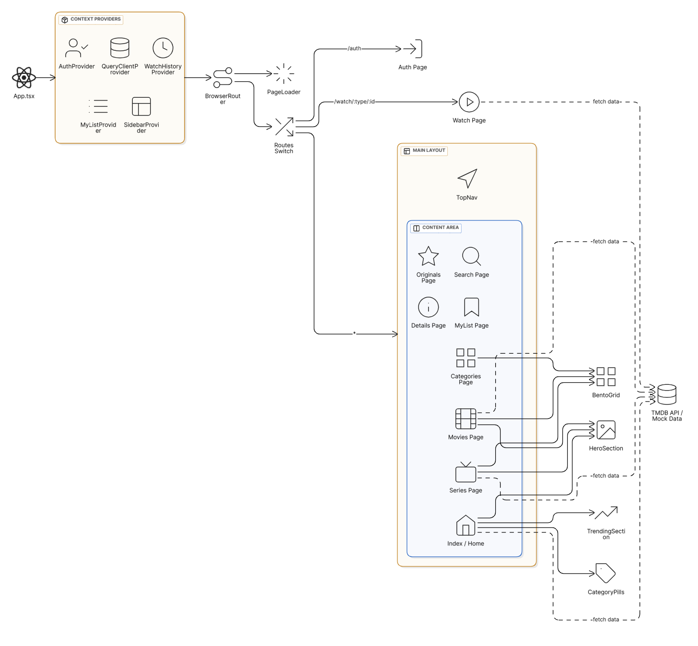

# CineVault UI/UX Studio

## Project Overview
CineVault is a premium movie streaming application interface designed with a focus on high-quality UI/UX. It features a modern, cinematic design with smooth animations and a responsive layout.

### Key Features
- **Premium UI Design**: A visually stunning interface inspired by top streaming platforms.
- **Responsive Layout**: Optimized for various screen sizes.
- **Dynamic Animations**: Powered by Framer Motion for a fluid user experience.
- **Content Discovery**: Features trending sections, category-based browsing, and detailed movie views.

## Architecture Diagram



## Technology Stack
- **Framework**: React (Vite)
- **Language**: TypeScript
- **Styling**: Tailwind CSS
- **UI Components**: Shadcn UI, Radix UI
- **Animations**: Framer Motion
- **Routing**: React Router DOM
- **State Management**: TanStack Query
- **Backend/Auth**: Supabase (Integration ready)

## Getting Started

### Prerequisites
Ensure you have Node.js installed on your system.

### Installation
1. Clone the repository or navigate to the project directory.
2. Install dependencies:
   ```bash
   npm install
   ```

### Running the Project
To start the development server, run:
```bash
npm run dev
```
The application will be available at `http://localhost:8080` (or the port shown in the terminal).

### Building for Production
To build the project for production:
```bash
npm run build
```

### Linting
To run the linter:
```bash
npm run lint
```
